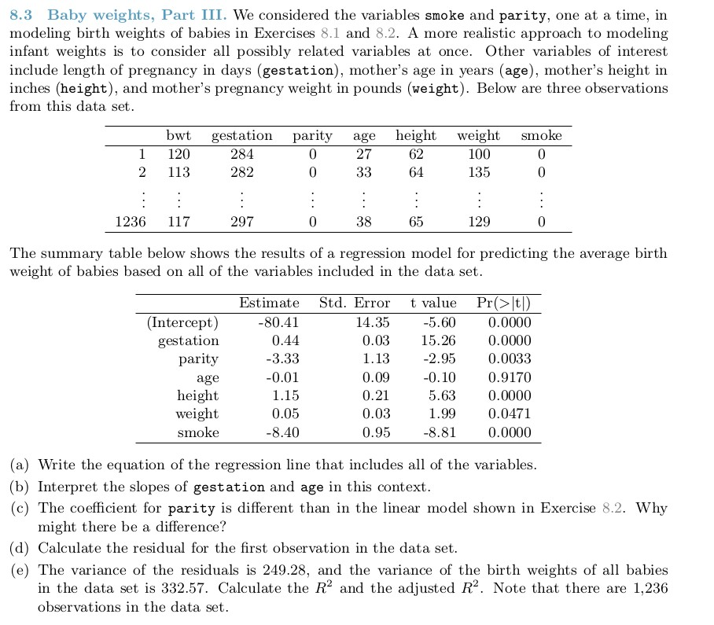

#### a) By looking at the Estimate column in the summary table, we can create the 

#### regression line as follows:

\[
\hat{bwt} = -80.41 + 0.44 * \hat{gestation} - 3.33 * \hat{parity}
- 0.01 * \hat{age} + 1.15 * \hat{height} + 0.05 * \hat{weight} 
- 8.40 * \hat{smoke}
\]

#### b) For gestation, we can interpret the slope of it by holding all other variables

#### constant and note that for every day the mother is in pregnancy, the baby weight

#### goes up by a factor of 0.44.

#### Likewise for the age variable, the older the mother, the baby weight is expected

#### to go down by a factor of -0.01.

#### c) Since we have added new variables to the model, the model is adjusted and

#### re-fitted and the parameter estimates change to create the model.

####d) The residual of the first observation is calculated as follows:

\[
$\hat{e_1} = bwt_1 - \hat{bwt_1} = 120 - (-80.41 + 0.44 * 284 - 3.33 * 0
- 0.01 * 27 + 1.15 * 62 + 0.05 * 100 - 8.40 * 0) = -0.58
\]

#### e) We can calcuate $R^2$ and $R^2_{adj}$ by using the information given and the 

#### formulas below:

$R^2 = 1 - (var(e_{i}) / var(y_{i}))$ and 

$R^2_{adj} = R^2 * (n-1 / n-k-1)$

#### In this case, n = 1236, k = 6 (6 predictors)
$var(e_{i}) = 249.28$ and $var(y_{i}) = 332.57$

#### Plugging in the numbers gives us 

$R^2 = 1 - (249.28 / 332.57) = 0.25$ (rounded to two decimal places)

$R^2_{adj} =  0.25 * (1235 / 1229) = 0.25$

